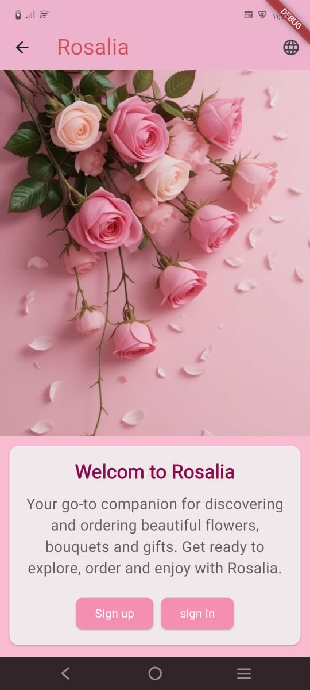
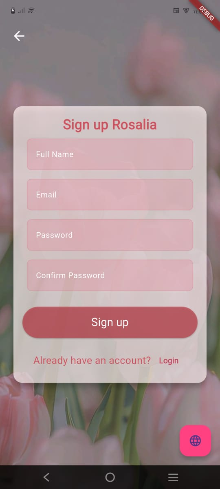
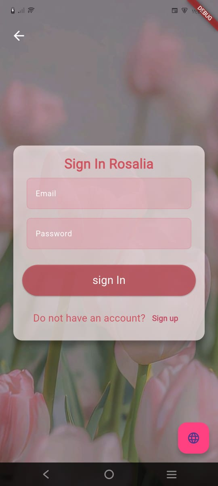
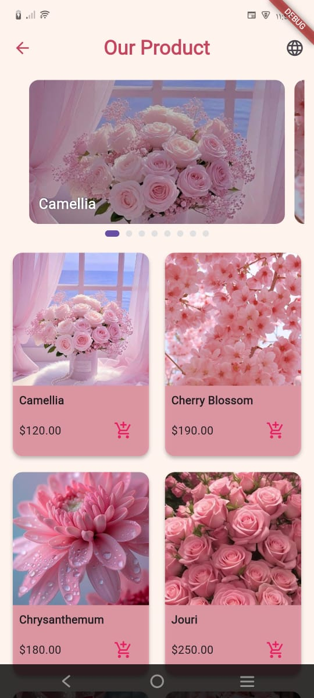
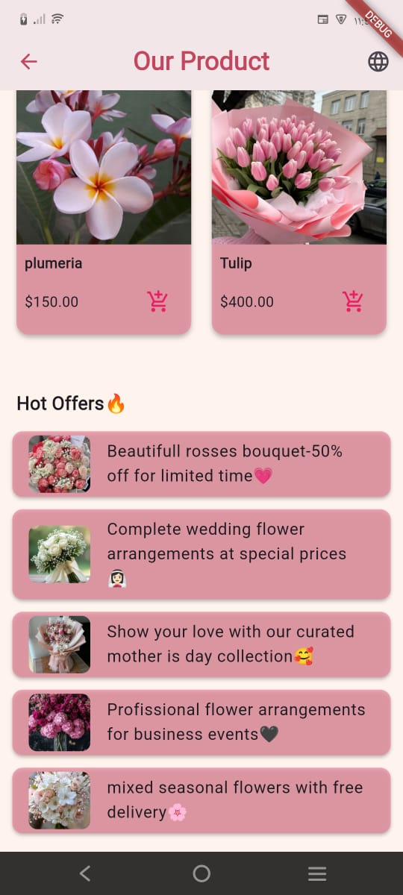

# 🌸 Rosalia - Flower Shopping App

## 📌 Project Overview
Rosalia هو تطبيق تسوق للزهور 🌺 يتيح للمستخدمين:
- استعراض أنواع مختلفة من الزهور مع تفاصيلها.
- تصفح العروض الخاصة (Hot Offers).
- تسجيل الدخول والتسجيل (Sign In / Sign Up).
- دعم تعدد اللغات (العربية / الإنجليزية).
- تجربة مستخدم سلسة مع انتقالات (Smooth Transitions).

---

## ✨ Features
- **Welcome Page**: صفحة البداية مع صور وخيارات تسجيل الدخول/التسجيل.
- **Sign Up / Sign In**: نماذج تسجيل مستخدمين مع Validators.
- **Localization**: دعم كامل للغتين العربية والإنجليزية.
- **Product Grid**: عرض الزهور في شكل شبكة مع إمكانية إضافة العناصر للسلة.
- **Hot Offers**: قائمة بالعروض المميزة.
- **Smooth Transition**: بعد التسجيل، الصفحة تتحول بسلاسة من Sign Up → Home.

---

## 🛠️ Setup Instructions
1. انسخ المشروع من GitHub:
   ```bash
   git clone https://github.com/MariamMostafa25/Rosalia_Sprints.git

## 2 .افتح المشروع في VS Code أو Android Studio.

نزل الـ dependencies:

flutter pub get


## 3.شغل التطبيق على Emulator أو جهاز حقيقي:

flutter run

## 📸 Screenshots

كل الـ screenshots موجودة في مجلد screenshots/ داخل المشروع.

أمثلة:






## 🧹 Code Quality

كل Widget / Class في ملف منفصل لسهولة التنظيم.

أسماء المتغيرات والدوال واضحة ومعبرة.

الكود منسق باستخدام dart format.

لا يوجد أكواد مكررة أو غير مستخدمة.

## 👩‍💻 Author

Mariam Mostafa AbdelNasser

GitHub:https://github.com/MariamMostafa25
Developed with ❤️ by Mariam Mostafa
